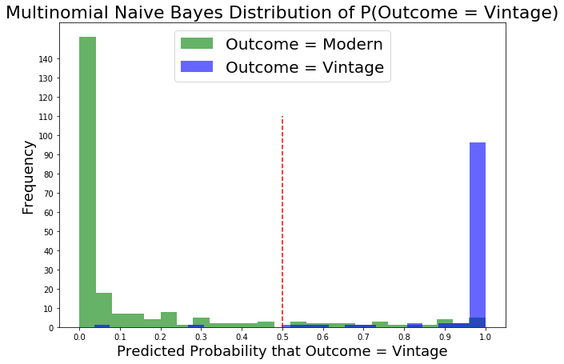

# Webscraping Magic The Gathering Subreddit Posts

### Contents:
- [Problem Statement](#Problem-Statement)
- [Executive Summary](#Executive-Summary)
- [Conclusions](#Conclusions)

### Problem Statement 

Problem Statement : We are white hat incorporated, a vast network of hackers that restore order and keep the piece. Reddit was hacked on Saturday bringing down the entire electric grid in midtown Manhattan with it.  It is now that we must step in and restore order.
Millions of dollars have been lost in the ads space. We have a small database of posts we can use to build a model that can index the subreddits and we need to have a notebook that is consistent, accurate and minimizes false positives.
A logistic regression model and a multinomial NB model were used in analysis. Logistic outperformed using ROC score and so I went with that as my main model to reindex all of the subreddits. Predictions were also analyzed using confusion matrix and scores like accuracy were calculated. Baseline of 0.73 was the mark to pass.

### Executive Summary

In this project we were given the task of predicting a posts subreddit based on the text provided. It is key to note that my approach of not using stop words failed miserably at first. I removed words above 3 letters long and below 18 as to remove hyperlinks. Needless to say I found that modern word count was evolved from vintage with unique high count words. This is interesting because this means this subreddit is a niche market. Below are two bar graphs of the top 20 words per subreddit.

As you can see in the two ROC curves below, the models are a toss up at best. With **a baseline of 0.73** and a **predicted ROC  score of 0.74** the 1% improvement is crap for a lack of a better term.

Next comes the meat of the work though. Below are the second iteration ROC curves

For the above ROC curves, I I count vectorized and lamatized the corpus. I used a voter classifier only to find that the logistic regression model was best, far outperforming the multinomial naive bayse model. The confusion matrix consisted of : **True Positive: 95 , True Negative: 237 , False Positive: 0* and False Negative: 14**. The star* indicates the worse case senario. This it is key to note that in the below distribution plots Vintage does not appear in Modern and vice versa. **Accuracy Rate: 0.96, Misclassification Rate: 0.04, Sensivitiy: 0.87, Specificity: 1.0, Precision: 1.0**

### Conclusions

The first attempt at removing stop words that were in too long and too short and not in the other subreddits failed to perform. In fact it was basically as good as a random guess.
The second method by which CountVectorizer removed stopwords and was applied yielded a fantastic score both for accuracy and precision as well as ROC AUC. 
Limitations are: Using this model for other subreddits unrelated to magic the gathering. For those posts we need to pull archives and follow the same procedure to make a different model.
Not for use in other languages. Apparent that the language evolves so use during time window of 6 to 12 months. This is the block size for magic. 
